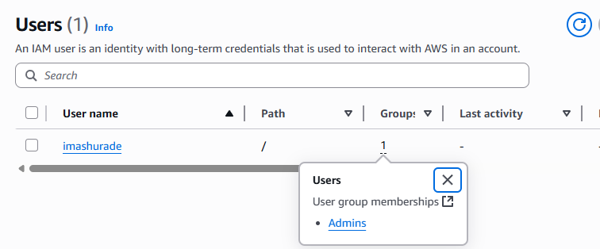
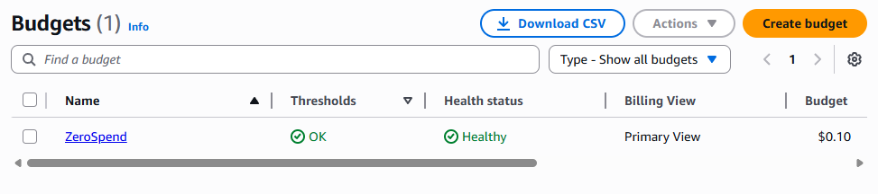
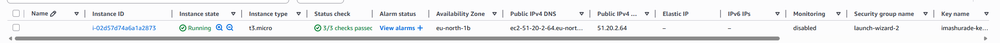
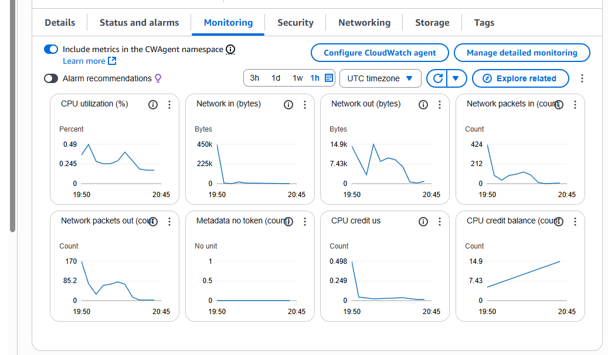
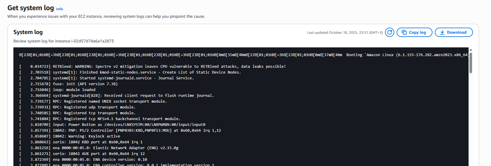
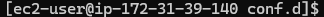
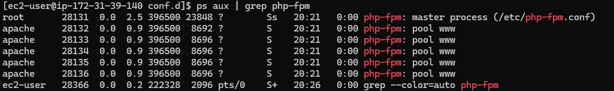
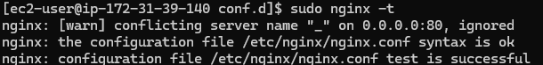
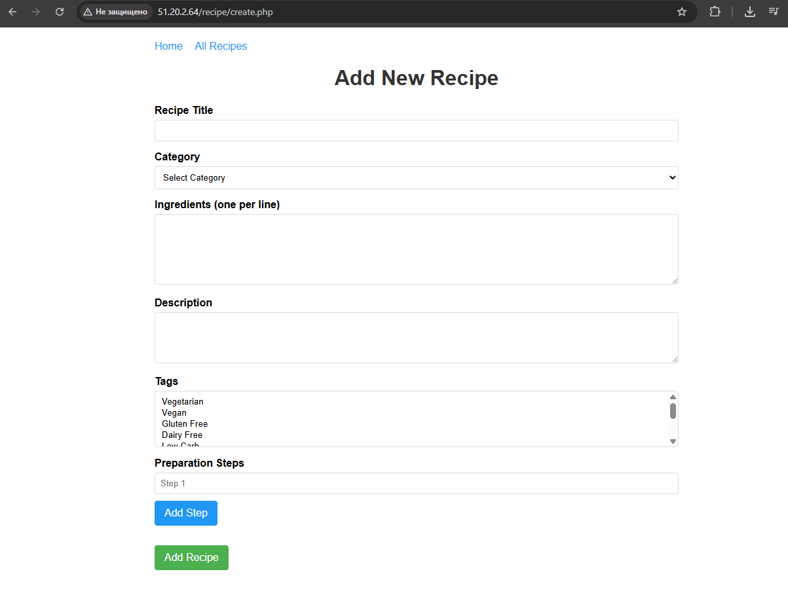

# Лабораторная работа №2. Введение в AWS. Вычислительные сервисы

## Описание работы

В этой лабораторной я познакомился с основами AWS, научился создавать виртуальные машины на EC2 и развернул на них веб-приложение на PHP. Основная цель - понять как работают облачные сервисы и научиться разворачивать приложения в реальной инфраструктуре.

## Цель работы

- Разобраться с базовыми сервисами AWS
- Научиться создавать и настраивать EC2 инстансы
- Развернуть PHP веб-приложение на удаленном сервере
- Настроить nginx и php-fpm для работы приложения

## Практическая часть

### Задание 0. Подготовка среды

Зарегистрировался на AWS и создал Free Tier аккаунт. Процесс стандартный - указал данные карты, подтвердил email. После регистрации зашел в консоль управления

### Задание 1. Создание IAM группы и пользователя

Открыл сервис IAM и создал группу **Admins**. К ней прикрепил политику **AdministratorAccess**.

Создал пользователя **cloudstudent**, добавил его в группу Admins и включил доступ к Management Console. После этого вышел из root-аккаунта и зашел под новым пользователем.



### Задание 2. Настройка Zero-Spend Budget

Перешел в Billing and Cost Management и создал бюджет с параметрами:
- **Budget name**: ZeroSpend
- **Email**: мой email

Теперь если я случайно превышу бесплатный лимит, мне придет уведомление. Полезная штука, чтобы не словить неожиданный счет.



### Задание 3. Создание EC2 инстанса

Открыл EC2 и нажал Launch instances. Заполнил параметры:

- **Name**: webserver
- **AMI**: Amazon Linux 2023 AMI
- **Instance type**: t3.micro (подходит под Free Tier)
- **Key pair**: Создал новую пару ключей **imashurade-keypair** и скачал `.pem` файл

Создал Security Group **webserver-sg** с правилами:
- HTTP (порт 80) - доступ с любого IP
- SSH (порт 22) - доступ только с моего текущего IP

В **User Data** вставил скрипт:

```bash
#!/bin/bash
dnf -y update
dnf -y install htop
dnf -y install nginx
systemctl enable nginx
systemctl start nginx
```

Запустил инстанс и дождался статуса **Running** и **2/2 checks passed**.



Проверил что nginx работает - открыл в браузере `http://<Public-IP>` и увидел стандартную страницу nginx.

### Задание 4. Логирование и мониторинг

Открыл вкладку **Status checks** - обе проверки прошли успешно:
- System reachability check - проверяет AWS инфраструктуру
- Instance reachability check - проверяет доступность ОС

Перешел на вкладку **Monitoring**. Там отображаются метрики CloudWatch - CPU, Network, Disk. Пока инстанс новый, графики почти пустые.



Посмотрел System Log через Actions → Get system log. Там видны логи загрузки системы и выполнения моего User Data скрипта - установка nginx и других пакетов.

Проверил Instance Screenshot - там просто консоль системы. Полезно если SSH не работает и нужно понять что происходит с сервером.



### Задание 5. Подключение по SSH

Перешел в директорию с ключом и установил правильные права:

```bash
cd ~/Downloads
chmod 400 imashurade-keypair.pem
```

Подключился к инстансу:

```bash
ssh -i imashurade-keypair.pem ec2-user@<Public-IP>
```



Проверил статус nginx:

```bash
systemctl status nginx
```

Все работает, nginx активен.

### Задание 6b. Развертывание PHP приложения

Я выбрал задание 6b - развертывание PHP сайта. Использовал приложение из lab04 курса Web Development - это система управления рецептами с возможностью добавления и просмотра рецептов.

#### Подготовка файлов

Локально у меня была структура:
```
/lab04/
  /public/
    index.php
  /src/
    ...PHP классы...
```

Скопировал файлы на сервер:

```bash
scp -i imashurade-keypair.pem -r ~/lab04/* ec2-user@<Public-IP>:/tmp/webapp
```


#### Установка необходимых пакетов

Подключился по SSH и установил PHP и php-fpm:

```bash
sudo dnf -y install php php-fpm php-mysqlnd php-json
sudo systemctl enable nginx php-fpm
sudo systemctl start php-fpm
```

Перенес файлы приложения:

```bash
sudo mv /tmp/webapp/* /usr/share/nginx/html/
```

#### Настройка Nginx

Создал конфиг `/etc/nginx/conf.d/mywebsite.conf`:

```nginx
server {
  listen 80;
  server_name _;

  root /usr/share/nginx/html/public;
  index index.php index.html;

  location / {
      try_files $uri $uri/ =404;
  }

  location ~ \.php$ {
      include snippets/fastcgi-php.conf;
      fastcgi_pass unix:/run/php-fpm/www.sock;
  }

  location ~ /\.ht {
      deny all;
  }
}
```

#### Проблема с fastcgi-php.conf

Тут я столкнулся с проблемой - в Amazon Linux нет файла `/etc/nginx/snippets/fastcgi-php.conf`, который я указал в конфиге. Nginx выдавал ошибку при проверке конфигурации.

Решил создать этот файл самостоятельно:

```bash
sudo mkdir -p /etc/nginx/snippets
sudo nano /etc/nginx/snippets/fastcgi-php.conf
```

Содержимое файла:

```nginx
include fastcgi_params;
fastcgi_pass unix:/run/php-fpm/www.sock;
fastcgi_index index.php;
fastcgi_param SCRIPT_FILENAME $document_root$fastcgi_script_name;
```

Это базовые параметры для работы FastCGI - они говорят как передавать запросы в php-fpm и какие переменные окружения устанавливать.

#### Проблема с правами доступа

После этого nginx запустился, но PHP-скрипты не выполнялись. В error.log видел ошибки доступа - оказалось php-fpm запускается от пользователя `apache`, а файлы принадлежат `ec2-user`.



Исправил права:

```bash
sudo chown -R apache:apache /usr/share/nginx/html/public
sudo chown -R apache:apache /usr/share/nginx/html/src
sudo systemctl restart php-fpm
sudo systemctl restart nginx
```

После этого все заработало!

#### Проверка работы

Проверил конфиг nginx:

```bash
sudo nginx -t
```




Открыл браузер и зашел на `http://<Public-IP>` - приложение работает, можно добавлять и просматривать рецепты.




**Чем Stop отличается от Terminate?**  
Stop - это просто остановка виртуальной машины, данные сохраняются и можно запустить снова. Terminate - это полное удаление инстанса, все данные теряются навсегда. Stop как "выключить комп", Terminate как "выбросить комп в мусорку".

## Контрольные вопросы

**1. Что делает политика AdministratorAccess?**  
Эта политика дает полный доступ ко всем сервисам и ресурсам AWS. По сути это root-права внутри аккаунта - можно создавать, изменять и удалять любые ресурсы. В продакшене такие права обычно дают только DevOps-инженерам и системным администраторам.

**2. Что такое User Data и какую роль выполняет данный скрипт? Для чего используется nginx?**  
User Data - это скрипт, который автоматически выполняется при первом запуске EC2 инстанса. Это как автозапуск программ в Windows, только для настройки сервера. Мой скрипт обновляет систему, ставит htop для мониторинга процессов и устанавливает nginx.

Nginx - это веб-сервер, который принимает HTTP-запросы от пользователей и отдает им контент. В моем случае он работает как прокси между браузером пользователя и PHP-приложением - принимает запросы на 80 порту и передает их в php-fpm для обработки.

**3. В каких случаях важно включать детализированный мониторинг?**  
Детализированный мониторинг (метрики каждую минуту) нужен когда важна каждая секунда. Например:
- В production окружении с высокой нагрузкой - чтобы быстро заметить проблемы
- При настройке автоскейлинга - чтобы вовремя добавлять новые серверы
- Во время дебага проблем с производительностью - чтобы точно понять когда началась просадка

Для тестовых серверов базового мониторинга (каждые 5 минут) обычно хватает.

**4. Почему в AWS нельзя использовать пароль для входа по SSH?**  
Пароли - это слабое звено безопасности. Их можно подобрать брутфорсом, пользователи часто ставят простые пароли типа "123456". SSH-ключи используют асимметричную криптографию - это намного безопаснее.

Плюс, AWS вообще не знает твой приватный ключ (только публичный хранится на сервере), так что даже если кто-то взломает AWS, он не сможет подключиться к твоим серверам. С паролями такой защиты нет.

**5. Что делает команда scp?**  
SCP (Secure Copy Protocol) - это утилита для безопасного копирования файлов между компьютерами через SSH. Работает как обычный `cp`, только по сети. Параметр `-r` означает рекурсивное копирование со всеми подпапками и файлами внутри.

**6. Что делает конфигурационный файл nginx?**  
Конфиг говорит nginx:
- Слушать на 80 порту (стандартный HTTP)
- Использовать `/usr/share/nginx/html/public` как корневую директорию сайта
- Искать index.php как главную страницу
- Когда приходит запрос на `.php` файл - передавать его в php-fpm через unix socket для выполнения
- Блокировать доступ к `.htaccess` файлам (директива `deny all`)

В общем, это инструкция "как обрабатывать входящие запросы".

**7. Чем Stop отличается от Terminate?**  
Stop - это просто остановка виртуальной машины, все данные на диске сохраняются и инстанс можно запустить снова когда понадобится. При этом перестают начисляться деньги за compute (CPU), но за storage (диск) платить продолжаешь.

Terminate - это полное удаление инстанса навсегда.

## Выводы

В ходе работы я разобрался с основами AWS - создал IAM пользователя, запустил EC2 инстанс, настроил security groups и развернул PHP-приложение с нуля. 

AWS оказался достаточно удобным, хотя интерфейс местами перегружен. Понравилось что можно быстро поднять сервер и сразу работать с ним. 

## Использованные источники

1. Официальная документация AWS EC2 - https://docs.aws.amazon.com/ec2/
2. Документация Nginx - https://nginx.org/ru/docs/
3. PHP-FPM документация - https://www.php.net/manual/ru/install.fpm.php
4. Материалы курса Cloud Computing