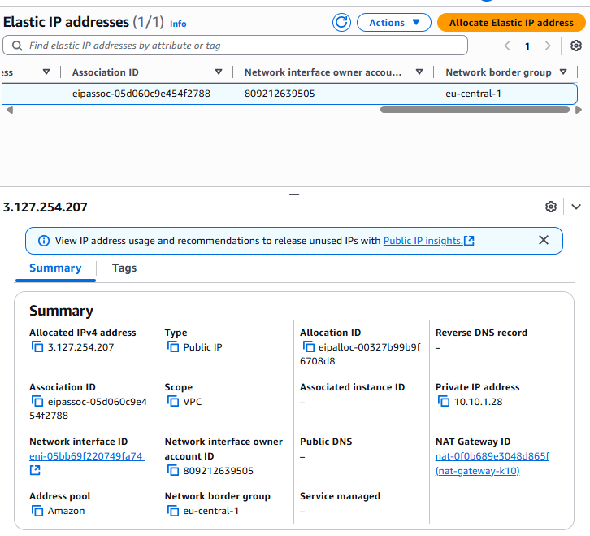
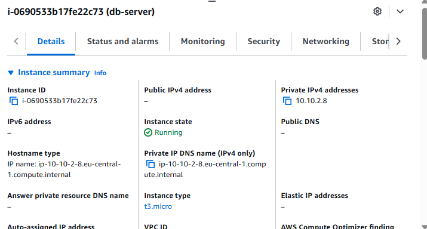
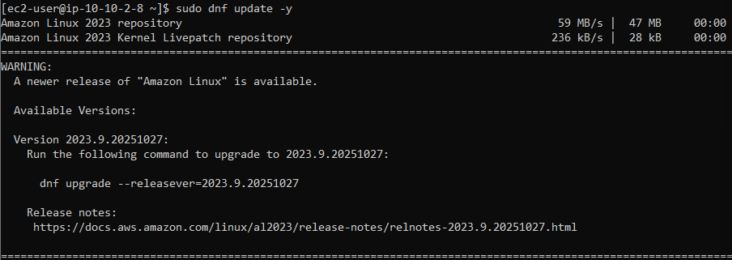

# Лабораторная работа №3. Облачные сети (AWS VPC)

## Описание лабораторной работы

В этой лабораторной работе я создавал виртуальную сеть в Amazon Web Services с нуля. Основная идея была в том, чтобы разобраться, как работает изоляция сетей в облаке и как правильно настроить взаимодействие между публичными и приватными ресурсами.

## Постановка задачи

Нужно было вручную создать VPC (Virtual Private Cloud) в AWS и настроить в ней:
- Публичную подсеть для веб-сервера (с доступом из интернета)
- Приватную подсеть для базы данных (без прямого доступа извне)
- Internet Gateway для публичного доступа
- NAT Gateway для выхода приватных ресурсов в интернет
- Правильные таблицы маршрутизации
- Security Groups для контроля трафика
- Три EC2 инстанса: веб-сервер, сервер БД и bastion host

## Цель работы

После выполнения этой лабы я должен был:
- Понять, как работает изоляция сетей в AWS
- Научиться создавать и связывать сетевые компоненты
- Разобраться, как EC2-инстансы в разных подсетях взаимодействуют между собой
- Понять разницу между публичными и приватными маршрутами

## Практическая часть

### Шаг 1. Подготовка среды

Первым делом я зашел в AWS Management Console и убедился, что работаю в регионе Frankfurt (eu-central-1). Это важно, потому что все ресурсы должны быть в одном регионе.

Потом открыл консоль VPC через поиск.


### Шаг 2. Создание VPC

Здесь я создавал основу для всей сети - саму VPC. Это как виртуальный датацентр, внутри которого будут все остальные ресурсы.

Параметры, которые я указал:
- **Name tag**: `student-vpc-k10`
- **IPv4 CIDR block**: `10.[ВАШ_k%10].0.0/16`
- **Tenancy**: Default


#### Ответ на контрольный вопрос: Что обозначает маска /16? И почему нельзя использовать /8?

Маска /16 означает, что первые 16 бит IP-адреса зарезервированы под сеть, а остальные 16 бит можно использовать для хостов. Это дает нам 65,536 возможных IP-адресов (2^16), чего более чем достаточно для учебных целей.

Маску /8 использовать нельзя, потому что это огромная сеть на 16 миллионов адресов. AWS ограничивает размер VPC диапазоном от /16 (65,536 адресов) до /28 (16 адресов). Это сделано для эффективного использования IP-пространства и предотвращения злоупотреблений.

### Шаг 3. Создание Internet Gateway (IGW)

Internet Gateway - это точка входа/выхода в интернет для нашей VPC. Без него даже с публичным IP инстанс не сможет общаться с внешним миром.

Я создал IGW с именем `student-igw-k10` и прикрепил его к своей VPC.


### Шаг 4. Создание подсетей

Подсети нужны для разделения ресурсов по функционалу. У меня будет две: одна публичная (для веб-сервера), другая приватная (для базы данных).

#### Шаг 4.1. Публичная подсеть

Параметры публичной подсети:
- **VPC ID**: моя `student-vpc-k10`
- **Subnet name**: `public-subnet-k10`
- **Availability Zone**: eu-central-1a
- **IPv4 CIDR block**: `10.[ВАШ_k%10].1.0/24`


#### Ответ на контрольный вопрос: Является ли подсеть "публичной" на данный момент? Почему?

Нет, пока не является. Подсеть становится публичной только тогда, когда в её таблице маршрутизации есть маршрут в интернет через Internet Gateway. Сейчас я просто создал подсеть, но не настроил маршруты, так что она пока изолирована.

#### Шаг 4.2. Приватная подсеть

Параметры приватной подсети:
- **VPC ID**: моя `student-vpc-k10`
- **Subnet name**: `private-subnet-k10`
- **Availability Zone**: eu-central-1b (другая зона)
- **IPv4 CIDR block**: `10.[ВАШ_k%10].2.0/24`


#### Ответ на контрольный вопрос: Является ли подсеть "приватной" на данный момент? Почему?

Технически да, но по сути она просто изолирована. Приватной мы её называем, потому что планируем не давать ей прямой доступ в интернет через IGW. Позже я добавлю NAT Gateway, чтобы ресурсы могли выходить наружу, но извне к ним никто не мог достучаться.

### Шаг 5. Создание таблиц маршрутов

Таблицы маршрутов определяют, куда идет трафик. Я создал две отдельные таблицы для лучшего контроля над сетью.

#### Шаг 5.1. Публичная таблица маршрутов

Создал таблицу `public-rt-k10` и добавил маршрут:
- **Destination**: 0.0.0.0/0 (весь трафик, который не относится к локальной сети)
- **Target**: мой Internet Gateway


Потом привязал эту таблицу к `public-subnet-k10`.

**[ВСТАВИТЬ СКРИНШОТ: Subnet associations с привязанной публичной подсетью]**

#### Ответ на контрольный вопрос: Зачем необходимо привязать таблицу маршрутов к подсети?

Привязка нужна, чтобы подсеть знала, куда направлять трафик. Без привязки подсеть использует дефолтную таблицу маршрутов VPC, которая не имеет доступа в интернет. По сути, таблица маршрутов говорит: "Если трафик идет на такой-то адрес, отправь его туда-то". Без этой связи подсеть не будет знать, как роутить пакеты.

#### Шаг 5.2. Приватная таблица маршрутов

Создал таблицу `private-rt-k10` и привязал к `private-subnet-k10`.

**[ВСТАВИТЬ СКРИНШОТ: Создание приватной route table]**


На этом этапе маршруты в интернет я не добавлял - это будет позже через NAT Gateway.

### Шаг 6. Создание NAT Gateway

NAT Gateway нужен, чтобы приватные ресурсы могли выходить в интернет (например, для обновлений), но при этом оставались недоступными снаружи.

#### Ответ на контрольный вопрос: Как работает NAT Gateway?

NAT Gateway работает как посредник. Когда инстанс из приватной подсети хочет выйти в интернет, запрос идет через NAT Gateway. NAT заменяет приватный IP инстанса на свой публичный IP, отправляет запрос наружу, получает ответ и возвращает его обратно инстансу. Получается, что с точки зрения внешнего мира все запросы идут от NAT Gateway, а не от конкретного инстанса. При этом входящие соединения извне NAT не пропускает - только исходящие.

#### Шаг 6.1. Elastic IP

Сначала я выделил статический IP-адрес для NAT Gateway.



#### Шаг 6.2. Создание NAT Gateway

Параметры:
- **Name tag**: `nat-gateway-k10`
- **Subnet**: `public-subnet-k10` (важно: NAT должен быть в публичной подсети!)
- **Connectivity type**: Public
- **Elastic IP**: выбрал созданный EIP


Подождал пару минут, пока статус изменился на Available.

#### Шаг 6.3. Обновление приватной таблицы маршрутов

Теперь добавил маршрут в приватную таблицу:
- **Destination**: 0.0.0.0/0
- **Target**: мой NAT Gateway


Теперь приватная подсеть может выходить в интернет через NAT.

### Шаг 7. Создание Security Groups

Security Groups - это виртуальные файрволы для EC2 инстансов. Я создал три группы для разных целей.

#### Web Security Group (`web-sg-k10`)

Inbound правила:
- HTTP (TCP/80) от 0.0.0.0/0
- HTTPS (TCP/443) от 0.0.0.0/0

#### Bastion Security Group (`bastion-sg-k10`)

Inbound правила:
- SSH (TCP/22) от MyIp

#### Database Security Group (`db-sg-k10`)

Inbound правила:
- MySQL/Aurora (TCP/3306) от web-sg-k10
- MySQL/Aurora (TCP/3306) от bastion-sg-k10
- SSH (TCP/22) от bastion-sg-k10

#### Все три security groups в списке:


#### Ответ на контрольный вопрос: Что такое Bastion Host и зачем он нужен?

Bastion Host (или jump server) - это специальный сервер в публичной подсети, через который можно безопасно подключаться к приватным ресурсам. Представь, что у тебя есть сервер БД в приватной сети без публичного IP. Напрямую к нему не подключиться. Вот для этого и нужен bastion - ты подключаешься сначала к нему по SSH, а потом уже с него к приватным серверам. Это безопаснее, чем давать каждому серверу публичный IP, потому что есть одна контролируемая точка входа.

### Шаг 8. Создание EC2 инстансов

Я создал три инстанса: веб-сервер, сервер БД и bastion host. Для всех использовал Amazon Linux 2, тип t3.micro и создал новый ключ `student-key-k10`.

**[ВСТАВИТЬ СКРИНШОТ: Создание и скачивание key pair]**

#### Web Server (`web-server-k10`)

Параметры:
- VPC: `student-vpc-k10`
- Subnet: `public-subnet-k10`
- Auto-assign Public IP: Enable
- Security Group: `web-sg-k10`

User data скрипт (устанавливает Apache и PHP):
```bash
#!/bin/bash
dnf install -y httpd php
echo "<?php phpinfo(); ?>" > /var/www/html/index.php
systemctl enable httpd
systemctl start httpd
```

#### Database Server (`db-server-k10`)

Параметры:
- VPC: `student-vpc-k10`
- Subnet: `private-subnet-k10`
- Auto-assign Public IP: Disable (важно!)
- Security Group: `db-sg-k10`

User data скрипт (устанавливает MariaDB):
```bash
#!/bin/bash
dnf install -y mariadb105-server
systemctl enable mariadb
systemctl start mariadb
mysql -e "ALTER USER 'root'@'localhost' IDENTIFIED BY 'StrongPassword123!'; FLUSH PRIVILEGES;"
```

#### Bastion Host (`bastion-host-k10`)

Параметры:
- VPC: `student-vpc-k10`
- Subnet: `public-subnet-k10`
- Auto-assign Public IP: Enable
- Security Group: `bastion-sg-k10`

User data скрипт (устанавливает MySQL клиент):
```bash
#!/bin/bash
dnf install -y mariadb105
```

#### Созданные три instance:





### Шаг 9. Проверка работы

Теперь самое интересное - проверить, что все работает как надо.

#### Проверка веб-сервера

Я открыл в браузере публичный IP веб-сервера (`http://3.75.224.37`) и увидел страницу с информацией о PHP.

Это значит, что:
- IGW работает
- Публичная подсеть настроена правильно
- Security group пропускает HTTP трафик
- User data скрипт выполнился и установил Apache с PHP

#### Подключение к Bastion Host

Подключился к bastion по SSH:
```bash
ssh -i student-key-k10.pem ec2-user@3.66.167.101
```


Проверил доступ в интернет:
```bash
ping -c 4 google.com
```


Пинги прошли - значит публичная подсеть и IGW работают корректно.

#### Подключение к Database Server

С bastion host подключился к серверу БД:
```bash
mysql -h 10.10.2.8 -u root -p
```

Ввел пароль `StrongPassword123!`.

Подключение прошло успешно! Это значит, что:
- Приватная подсеть настроена правильно
- Security groups работают (db-sg пропускает трафик от bastion-sg)
- Сервер БД установился и запустился через user data


### Шаг 10. Дополнительные задания. Подключение в приватную подсеть через Bastion Host
У пользователя нет прямого доступа к приватной подсети, но он может подключиться к db-server через bastion-host.

Используем SSH Agent Forwarding для упрощения доступа:

Запускаем SSH Agent и добавляем наш приватный ключ в агент:

```
eval "$(ssh-agent -s)"
ssh-add student-k10.pem
```

Подключаемся к bastion-host с опцией *-A* и *'-J'*:

```
ssh -A -J ec2-user@<Bastion-Host-Public-IP> ec2-user@<DB-Server-Private-IP>
```


#### Что делает опция -A и -J?
---

#### Обновите систему на db-server:

```
sudo dnf update -y
```




#### Установите htop:
```
sudo dnf install -y htop
```


Если обновление и установка прошли успешно, значит NAT Gateway работает корректно.

#### Подключаемся к MySQL серверу:

```
mysql -u root -p
```

Если не установлен mysql клиент, установите его командой sudo dnf install -y mariadb105. Ввожу пароль easypass так как он у меня легкий.

```

```

## Список использованных источников

1. Методические материалы лабораторной работы №3
2. [AWS VPC Documentation](https://docs.aws.amazon.com/vpc/)
3. [AWS Security Groups Documentation](https://docs.aws.amazon.com/vpc/latest/userguide/vpc-security-groups.html)
4. [NAT Gateway Documentation](https://docs.aws.amazon.com/vpc/latest/userguide/vpc-nat-gateway.html)

## Вывод

В этой лабораторной работе я научился создавать и настраивать виртуальную сеть в AWS с нуля.
Основные моменты, которые я усвоил:

1. **VPC - это основа всего**. Без VPC вообще ничего не создашь в AWS. Это как твой собственный виртуальный датацентр.

2. **Подсети не публичные и не приватные по умолчанию** - все зависит от таблиц маршрутизации. Публичная подсеть имеет маршрут в интернет через IGW, приватная - не имеет прямого доступа наружу.

3. **NAT Gateway - это важная штука** для приватных подсетей. Без него серверы в приватной сети не смогут обновляться или скачивать что-то из интернета, но при этом NAT сохраняет их изолированность от внешнего мира.

4. **Security Groups работают как умный файрвол** - можно разрешать трафик не только по IP, но и от других security groups. Это удобно, когда нужно дать доступ одному сервису к другому.

5. **Bastion Host - это must-have** для работы с приватными серверами. Гораздо безопаснее иметь одну точку входа, чем раздавать публичные IP всем подряд.

Было интересно увидеть, как все эти компоненты работают вместе. Особенно круто, что можно настроить сеть так, чтобы база данных была полностью изолирована, но при этом веб-сервер мог к ней обращаться.

Единственное, что показалось немного муторным - это необходимость все удалять в правильном порядке в конце.
В целом, лаба была полезной. Теперь я понимаю основы сетевой инфраструктуры в облаке, и это точно пригодится в будущем.