# Лабораторная работа №4. Облачное хранилище данных. Amazon S3

## Цель работы

Познакомиться с сервисом Amazon S3 (Simple Storage Service) и отработать основные операции:

- создание публичного и приватного бакетов;
- загрузку и организацию объектов;
работу с S3 через AWS CLI (копирование, перемещение, синхронизация);
- настройку версионирования и шифрования;
- использование S3 Static Website Hosting;
- применение Lifecycle-правил для архивирования старых данных.


## Выполнение.

Amazon S3 — это объектное хранилище AWS, предназначенное для хранения файлов любого типа: изображений, резервных копий, документов, логов и т.д. Каждый объект хранится внутри бакета (bucket) и имеет уникальный ключ (key). "Папки" в консоли — это лишь префиксы ключей, а не настоящие директории.

В этой лабораторной вы создадите два бакета:

Публичный бакет - для хранения аватаров пользователей и статического контента;
Приватный бакет - для логов и служебных файлов (с Lifecycle-политикой).

# Шаг 1.
### Вариант B: Object Ownership Enforced (без ACL)
В этом варианте выполняем создание бакета с использованием современной модели доступа AWS S3, где ACL полностью отключены.

Все разрешения на доступ реализуются через Bucket Policy и IAM-пользователя.

Это тот подход, который используется в реальных корпоративных проектах: он безопаснее, масштабируемее и лучше контролируется через централизованные политики.

#### Шаг 1.1 Создание бакетов без ACL

1. Перехожу в AWS Console → S3 → Create bucket.

2. Задаю следующие параметры при создании бакета :

- Имя: cc-lab4-pub-kXX
- Регион: eu-central-1
- Object Ownership: выберите Bucket owner enforced (ACLs disabled)
- Block all public access enabled

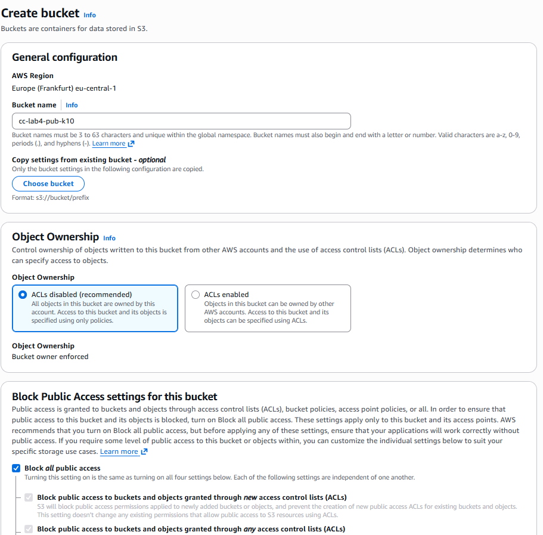

и так же 
#### Шаг 1.2 Создание IAM-пользователя и выдача прав

> В этом варианте мы создаем отдельного > пользователя AWS (s3-uploader) и даем > ему минимальные права работы с нашими > бакетами.

**Это иллюстрирует, как в AWS разделяют роли и принципы минимально необходимых прав (Least Privilege).**

#### Шаг 2.1 Создание пользователя
1. Перехожу в IAM → Users → Create user.
2. Создаю пользователя с именем s3-uploader.
3. Console access не включаю он нам не понадобиться.
4. Cозданный пользователь
 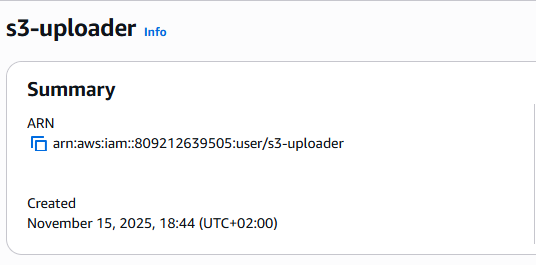
5. Так же понадобиться access key, так как этот пользователь будет использоваться при использовании sdk для различных языков.

#### Шar  1.2.2 Создание IAM-политики (минимальные права)

Политика - это JSON-документ, который определяет, какие действия разрешены или запрещены для пользователя.

Важный контекст про Allow/Deny

В IAM действует логика:

По умолчанию всё запрещено (implicit deny).

Effect: "Allow" разрешает указанные действия на указанных ресурсах.

Effect: "Deny" даёт явный запрет, который всегда сильнее любых Allow.

В этой политике только Allow, поэтому она описывает, что именно разрешено. Всё, что не перечислено как Allow (и не разрешено другими политиками), остаётся запрещённым.

*Первый блок: разрешить список содержимого бакетов*

```
{
  "Sid": "ListOnlyTheseBuckets",
  "Effect": "Allow",
  "Action": ["s3:ListBucket"],
  "Resource": [
    "arn:aws:s3:::cc-lab4-pub-k10",
    "arn:aws:s3:::cc-lab4-priv-k10"
  ]
}
```


- Version: версия языка политики, оставьте как есть.
- Statement: массив правил.
- Effect: действие правила - Allow (разрешить) или Deny (запретить).
- Action: список разрешённых действий (например, s3:PutObject для загрузки объектов).
- Resource: ARN (Amazon Resource Name) ресурсов, к которым применяется правило. ARN - это уникальный идентификатор ресурса в AWS, каждый ресурс имеет свой ARN. В данном случае, данные правила применяются к нашим бакетом. То есть это значит, что пользователь сможет выполнять указанные действия только с этими бакетами.

#### Шаг 2.3  Привязка политики к пользователю

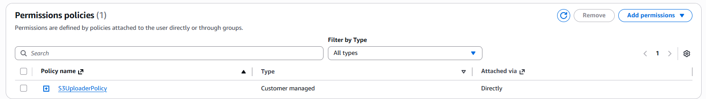

Только теперь пользователь получает доступ к S3. До этого момента AWS по умолчанию всё запрещает ("deny by default").

##### Шаг 3. Разрешение чтения из публичного бакета

Чтобы сделать файлы в публичном бакете доступными для всех (например, для отображения аватаров на сайте), нам нужно создать Bucket Policy, которая разрешит публичный доступ на чтение.

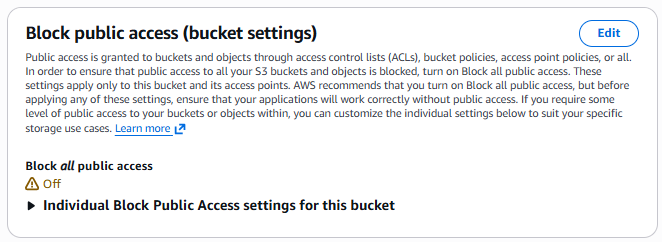

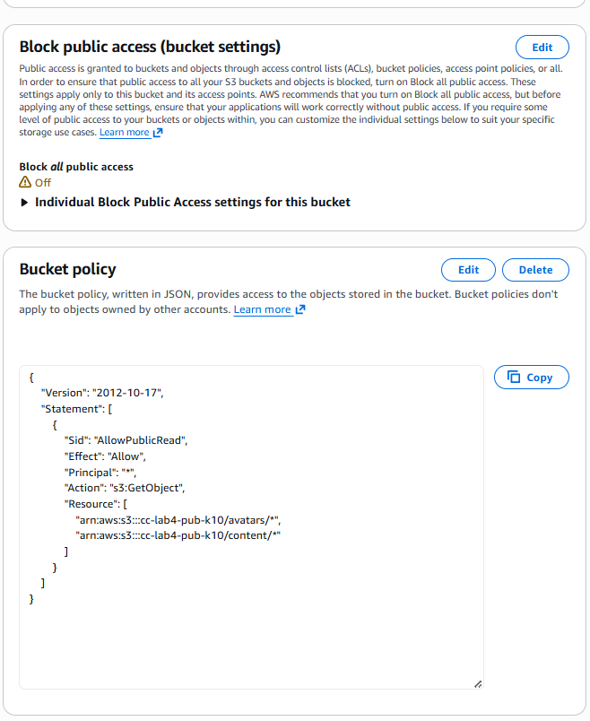

#### Шаг 4. Загрузка объектов через AWS CLI

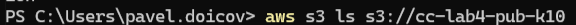


##### Загрузим файл user2.jpg в публичный бакет:

##### Команда:
```
aws s3 cp ./public/avatars/user2.jpg s3://cc-lab4-pub-k10/avatars/user2.jpg
```

##### Пример:

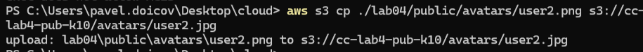

##### Загрузим activity.csv в приватный бакет, не делая его публичным.

```
aws s3 cp ./lab04/private/logs/activity.csv s3://cc-lab4-priv-k10/logs/activity.csv
```

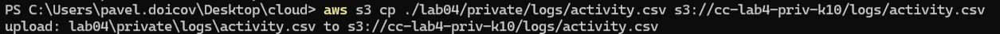

> В чём разница между командами aws s3  cp, mv и sync и для чего используется  параметр флаг --acl public-read?

#### Команда cp:
cp = copy - КОПИРОВАНИЕ файлов.

Используется для:

- загрузки файла в S3.
- скачивания файла из S3.
- копирования между бакетами.
- копироваия локальной папки в бакет\из бакета.

```
aws s3 cp file.txt s3://bucket/
aws s3 cp s3://bucket/file.txt ./local/
aws s3 cp ./images s3://bucket/images --recursive
```

#### Команда aws s3 mv

*mv* = move — ПЕРЕМЕЩЕНИЕ (копирует → затем удаляет исходник).

Используется, когда нужно:

- перенести файл в другой бакет

- переименовать файл

переместить локальные файлы в S3 и удалить локальные копии

Примечание:
> после операции ИСХОДНЫЙ файл удаляется
> работает медленнее, потому что 2 шага: copy → delete

#### Команда aws s3 sync

> sync = синхронизация двух директорий

Используется, когда нужно:

- синхронизировать локальную папку с S3
- зеркалировать один бакет в другой
- обновлять только изменённые файлы

#### Параметр --acl public-read

> ACL = Access Control List
> Это механизм, который позволяет задать 
> доступ к конкретному объекту.

##### Флаг:

```
    --acl public-read
```

##### означает:
объект будет доступен всем пользователям Интернета (только на чтение).

##### Пример:
```
aws s3 cp image.jpg s3://bucket/ --acl public-read
```

##### Однако у меня возникает ошибка "The bucket does not allow ACLs" ?

>Потому что современные S3 бакеты >используют режим:
>Bucket owner enforced (ACLs disabled)
>В этом режиме ACL полностью отключены:
>нельзя использовать параметр --acl

#### Шаг 5. Проверка доступа обьектам

Откроем в браузере URL загруженного публичного объекта:
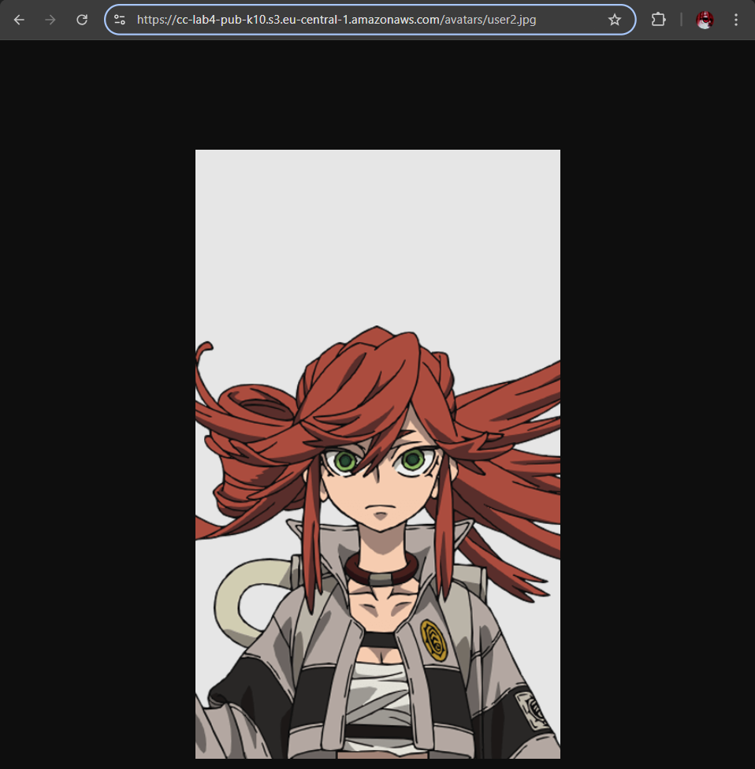

Попробуем открыть URL загруженного приватного объекта, он должен быть недоступен.
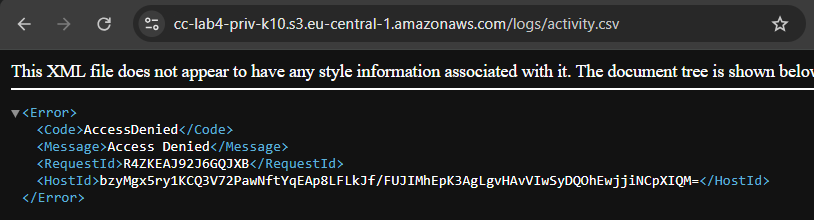

#### Шаг 6. Версионирование объектов

Включаем версионирования для обоих бакетов:
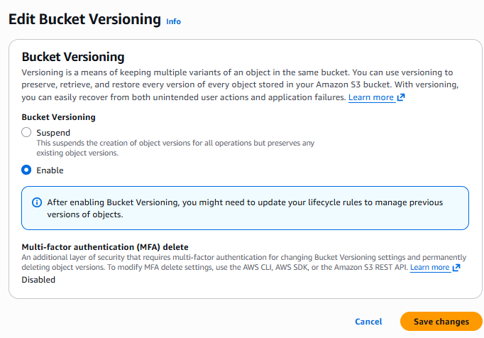

Пробуем заменить user2.jpg в бакете и получаем две версии.
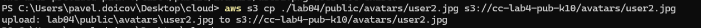
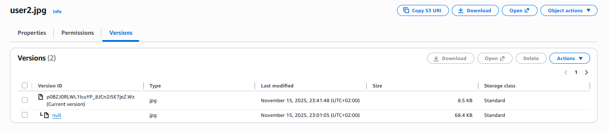

>Что произойдёт, если выключить версионирование после его включения?
>
>Отключение версионирования не .«возвращает» бакет к состоянию «версий никогда не было».
>Оно просто перестаёт создавать новые версии.
>
>Таким образом
>
>При отключении версионирования новые >версии объектов больше не создаются, >но все старые версии остаются в бакете.

#### Шаг 7. Создание Lifecycle-правил для приватного бакета

В приватном бакете заходим в Management → Lifecycle rules → Create rule.

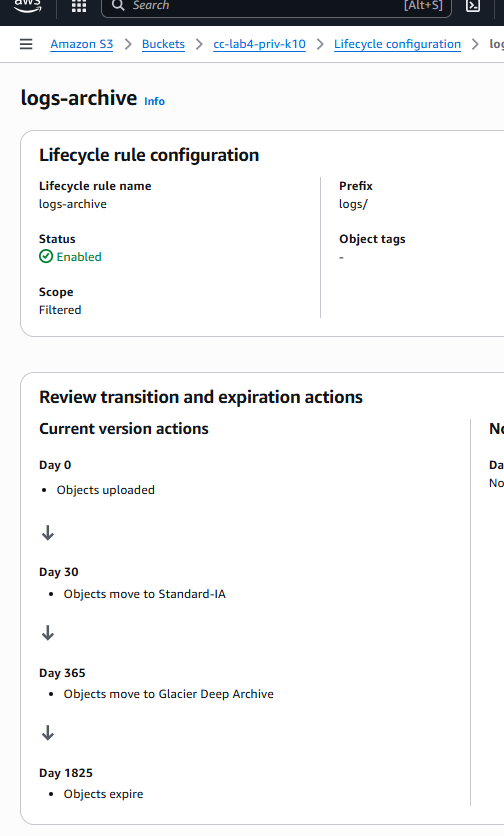

> Что такое Storage Class в Amazon S3 и зачем они нужны?

>Storage Class (класс хранения) в Amazon S3 — это режим хранения объектов, который определяет:
>
>стоимость хранения
>
>стоимость операций
>
>частоту доступа
>
>надёжность и время восстановления   (retrieval time)

>Проще говоря: S3 Storage Class — это разные уровни хранения, оптимизированные под разные сценарии 
>(частый доступ, редкий доступ, архив и т. д.), 
>чтобы вы не переплачивали заненужные ресурсы.

#### Шаг 8. Создание статического веб-сайта на базе S3

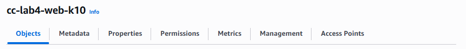

Настраиваем бакет для хоста статической страницы:
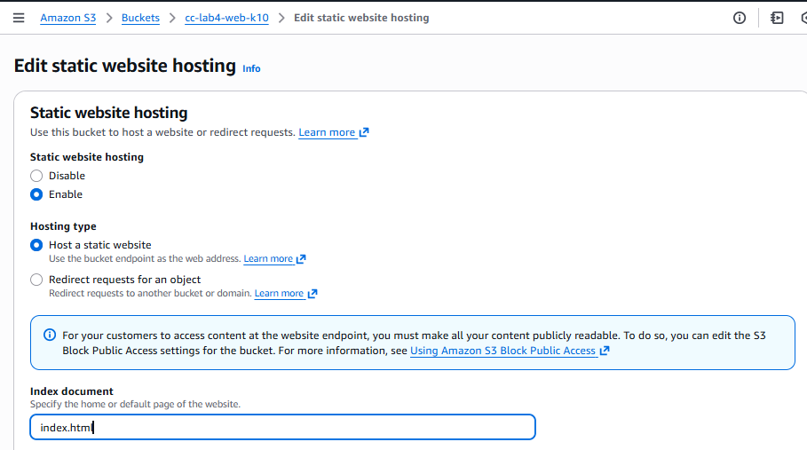

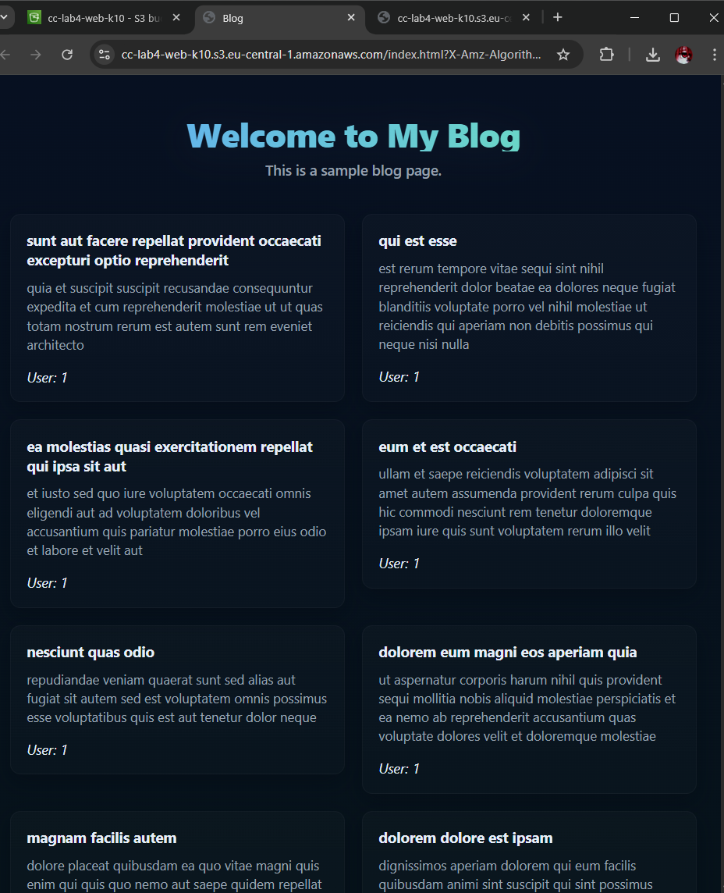

#### Шаг 9. Дополнительное задание. Загрузка файлов через AWS SDK

