### Лабораторная работа №5. Облачные базы данных. Amazon RDS, DynamoDB

## Цель работы

Целью работы является ознакомиться с сервисами Amazon RDS (Relational Database Service) и Amazon DynamoDB, а также научиться:

- Создавать и настраивать экземпляры реляционных баз данных в облаке AWS с использованием Amazon RDS.
- Понимать концепцию Read Replicas и применять их для повышения производительности и отказоустойчивости баз данных.
- Подключаться к базе данных Amazon RDS с виртуальной машины EC2 и выполнять базовые операции с данными (создание, чтение, обновление, удаление записей - CRUD).
- (Дополнительно) Ознакомиться с сервисом Amazon DynamoDB и освоить работу с хранением данных в NoSQL-формате.

>Для студентов специализации DevOps. 
>Для получения высшей оценки рекомендуется дополнительно автоматизировать процесс создания Security Groups и виртуальной машины EC2 с помощью инструмента Terraform.

### Шаг 1. Подготовка среды(VPC/подсети.SG)

1. Создайте VPC (project-vpc) с двумя публичными и двумя приватными подсетями в разных зонах доступности (AZ). В данной подсети будут развернуты ваши базы данных и приложение.
Для создания подсетей воспользуйтесь мастером создания VPC (Create VPC -> VPC and more) в консоли AWS или используйте VPC созданную в 3 лабораторной работе.

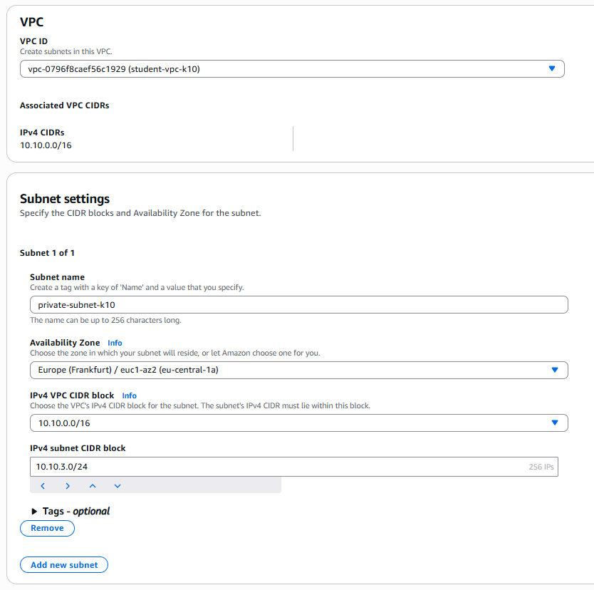

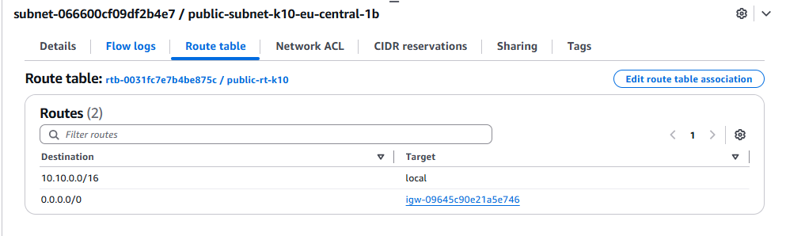


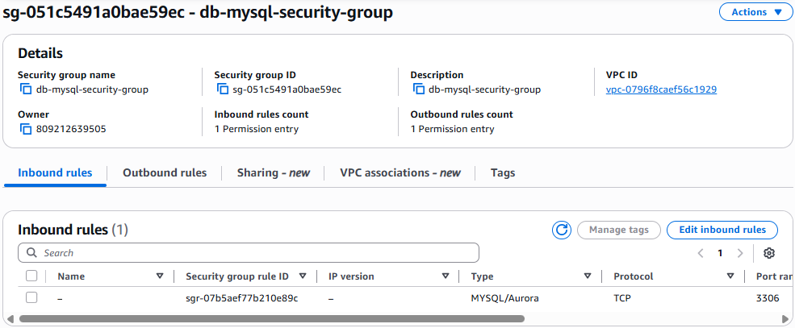

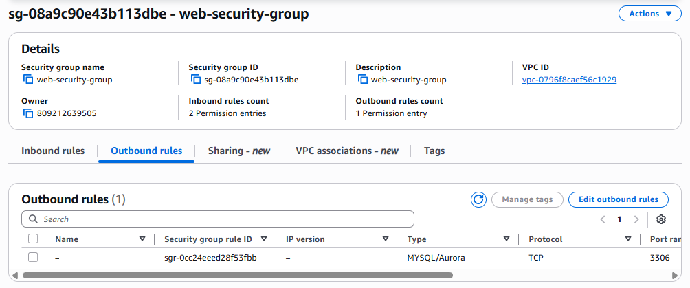

Проще говоря:
DB Subnet Group = список приватных подсетей в разных зонах доступности, где разрешено размещать вашу RDS/Aurora.

🧩 Зачем нужна DB Subnet Group?
1️⃣ Чтобы RDS мог размещать базу в нужных подсетях

RDS сам не выбирает, куда ему разворачиваться. Вы должны указать группы подсетей, в которых допустимо создание экземпляров.

Обычно это приватные подсети, чтобы база данных не была доступна из интернета.

2️⃣ Для высокой доступности (Multi-AZ)

При создании Subnet Group обязательно должны быть минимум две подсети из двух разных Availability Zones (например: eu-central-1a и eu-central-1b).

Это позволяет:

Размещать primary DB instance в одной зоне

Размещать standby replica в другой зоне

Если одна зона ляжет — база переключится на другую.

3️⃣ Без Subnet Group вы просто не сможете создать RDS

Это обязательное требование AWS:

RDS должен знать, в каких подсетях ему можно размещаться.
Если Subnet Group не указана — создание базы невозможно.

### Шаг 2. Развертывание Amazon RDS

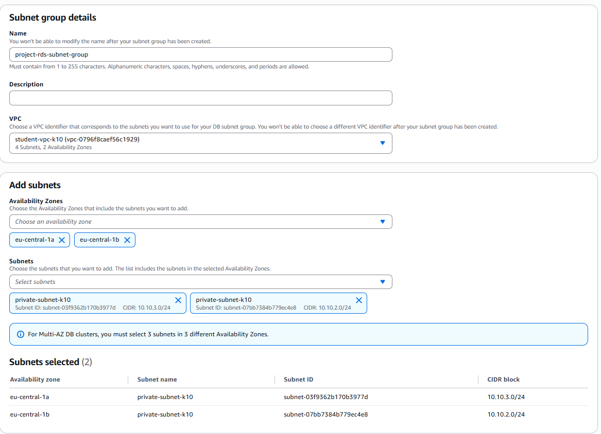

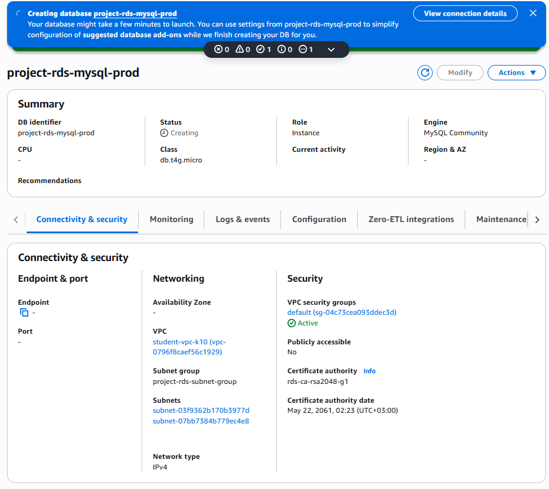

### Шаг 3. Создание виртуальной машины для подключения к базе данных

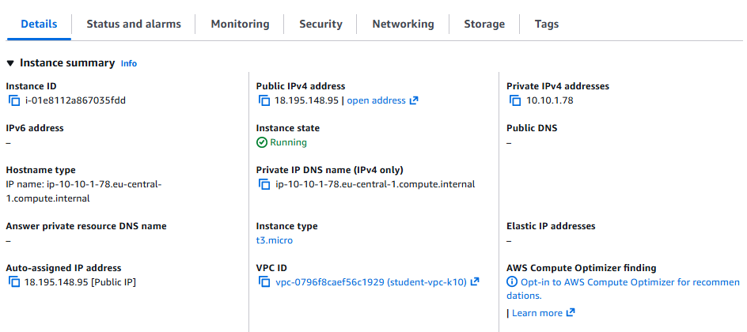

### Шаг 4. Подключение к базе данных и выполнение базовых операций

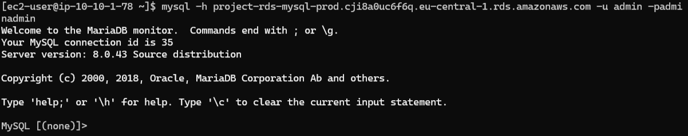

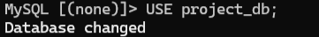

```sql
CREATE TABLE categories (
    id SERIAL PRIMARY KEY,
    name VARCHAR(255) NOT NULL
);

CREATE TABLE todos (
    id SERIAL PRIMARY KEY,
    title VARCHAR(255) NOT NULL,
    category_id INTEGER REFERENCES categories(id),
    status VARCHAR(50) NOT NULL
);
```

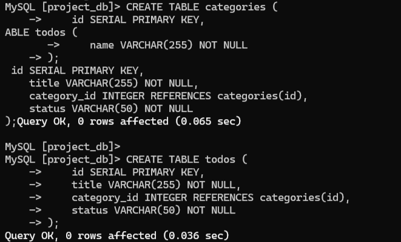

```
INSERT INTO categories (name)
VALUES
    ('Работа'),
    ('Дом'),
    ('Учёба');
```

```
INSERT INTO todos (title, category_id, status)
VALUES
    ('Подготовить отчёт', 1, 'in_progress'),
    ('Купить продукты', 2, 'pending'),
    ('Сделать домашнее задание', 3, 'completed'),
    ('Убраться в квартире', 2, 'pending'),
    ('Прочитать учебную главу', 3, 'in_progress');
```
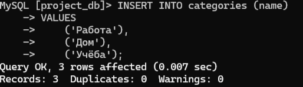


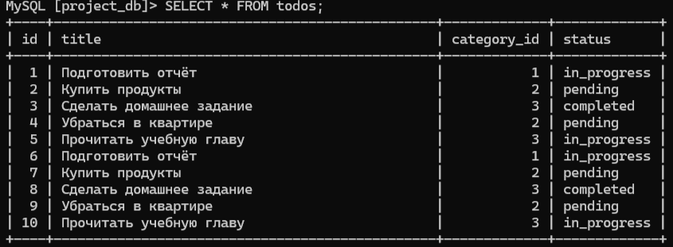

```
SELECT t.title, c.name AS category
FROM todos t
JOIN categories c ON t.category_id = c.id
WHERE t.status = 'pending';
```
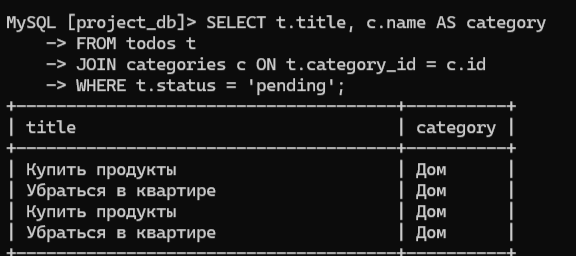


### Шаг 5. Создание Read Replica

Создаем read replica, по следующим шагам:

1. Выбераю базу данных RDS в консоли AWS.

2. Нажимаю на кнопку Actions и выбераю Create read replica.
3. Использую след. параметры для Read Replica:
4. DB instance identifier: project-rds-mysql-read-replica
5. Instance class: db.t3.micro
6. Storage type: General Purpose SSD (gp3)

*Monitoring*
7. Enable Enhanced monitoring: снимаем галочку
9. Public access: No
10. VPC security groups: выбераем ту же группу безопасности *db-mysql-security-group*


Подключаюсь к реплике и делаю операции на чтении:
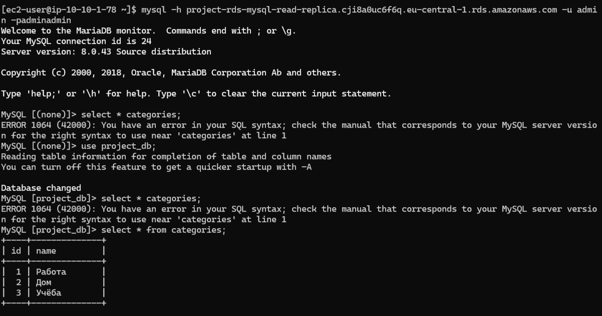

#### Почему?

>Потому что Read Replica работает в режиме асинхронной репликации.
>MySQL на главной базе записывает изменения в бинарные логи (binlogs), а реплика читает эти логи и применяет изменения у себя.

Возвращаюсь в основную бд и добавляю но

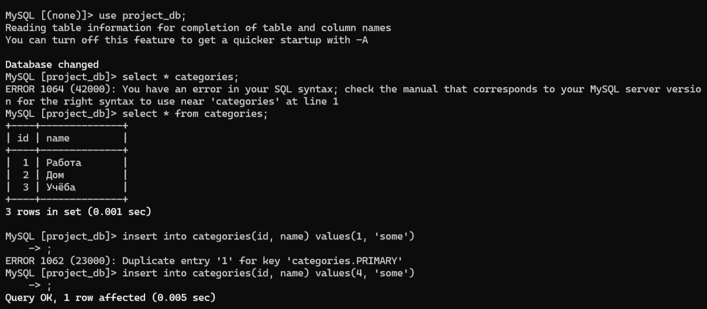

перехожу в реплику и вижу добавленную запись:


Read Replicas — это дополнительные копии вашей основной базы данных (primary/master), которые автоматически синхронизируются с ней только на чтение. Основная БД продолжает принимать записи (write), а реплики используются для чтения (read).

1. Снижение нагрузки на основную базу.
2. Увеличение производительности и скорости работы
3. Повышение отказоустойчивости

#### Шаг 6. Подключение приложения к базе данных

class TaskStatusAPITests(APITestCase):
    def setUp(self) -> None:
        self.account = AccountFactory()
        self.user = UserFactory()
        UserAccountFactory(user=self.user, account=self.account, role=User.Role.ADMIN)
        self.client.force_authenticate(user=self.user)
        TaskStatus.ensure_defaults_for_account(self.account.id)
        self.headers = {"HTTP_SAAS_APP_TOKEN": self.account.pk}

    def test_default_statuses_are_available(self):
        response = self.client.get(reverse("task_statuses-list"), **self.headers)

        self.assertEqual(response.status_code, status.HTTP_200_OK)
        names = [row["name"] for row in response.data["results"]]
        self.assertIn("To Do", names)
        self.assertIn("Done", names)

    def test_admin_can_create_custom_status(self):
        payload = {
            "name": "In Progress",
            "code": "in-progress",
            "color": "#f97316",
            "is_active": True,
        }

        response = self.client.post(reverse("task_statuses-list"), payload, format="json", **self.headers)

        self.assertEqual(response.status_code, status.HTTP_201_CREATED)
        created = TaskStatus.objects.get(pk=response.data["id"])
        # Two defaults exist already, so auto-order should be 3
        self.assertEqual(created.order, 3)
        self.assertFalse(created.is_default)

    def test_can_switch_default_status(self):
        status_obj = TaskStatusFactory(account=self.account, is_default=False)

        response = self.client.patch(
            reverse("task_statuses-detail", args=[status_obj.pk]),
            {"is_default": True},
            format="json",
            **self.headers,
        )

        self.assertEqual(response.status_code, status.HTTP_200_OK)
        status_obj.refresh_from_db()
        self.assertTrue(status_obj.is_default)
        self.assertEqual(
            TaskStatus.objects.filter(account=self.account, is_default=True).count(),
            1,
        )

    def test_cannot_delete_system_status(self):
        system_status = TaskStatus.objects.filter(account=self.account, is_system=True).first()

        response = self.client.delete(reverse("task_statuses-detail", args=[system_status.pk]), **self.headers)

        self.assertEqual(response.status_code, status.HTTP_400_BAD_REQUEST)
        self.assertTrue(TaskStatus.objects.filter(pk=system_status.pk).exists())

    def test_dropdown_hides_inactive_statuses(self):
        inactive_status = TaskStatusFactory(account=self.account, is_active=False)

        response = self.client.get(reverse("task_statuses-list-dropdown"), **self.headers)

        self.assertEqual(response.status_code, status.HTTP_200_OK)
        dropdown_ids = [row["key"] for row in response.data["results"]]
        self.assertNotIn(inactive_status.pk, dropdown_ids)

