# Лабораторная работа №6. Балансирование нагрузки в облаке и авто-масштабирование

## Цель работы
Закрепить навыки работы с AWS EC2, Elastic Load Balancer, Auto Scaling и CloudWatch, создав отказоустойчивую и автоматически масштабируемую архитектуру.

#Студент развернёт:

- VPC с публичными и приватными подсетями;
- Виртуальную машину с веб-сервером (nginx);
- Application Load Balancer;
- Auto Scaling Group (на основе AMI);
- нагрузочный тест с использованием CloudWatch.

## Условие

### Шаг 1. Создание VPC и подсетей

Захожу в VPC -> create -> create and more. Готово
Автоматически создаются:

- две публичные, две приватные подсети.
- public/private route tables.
- Internet gateway.

### Шаг 2. Создание и настройка виртуальной машины 

Создаю виртуальную машину с следующими параметрами:

> AMI: Amazon Linux 2
>
> Тип: t3.micro
> 
> VPC >>> Enable auto-assign public IP'
> 

### Создаю новую security group:

#### inbound rules:

>SSH (порт 22) — источник: ваш IP
>HTTP (порт 80) — источник: 0.0.0.0/0

#### outbound rules:

> Все трафики — источник: 0.0.0.0/0

*включаю cloudwatch monitoring*
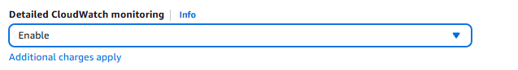

### Полученный инстанс

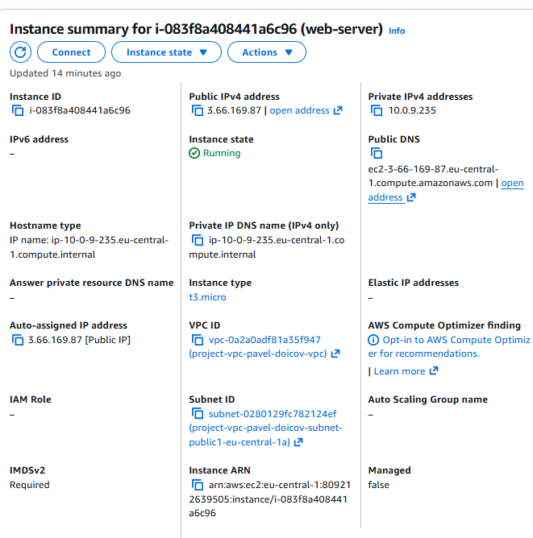
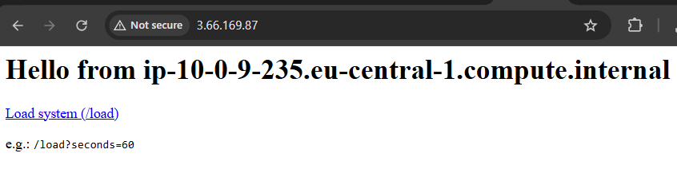

## Шаг 3. Создание AMI

Я перехожу в раздел **EC2 → Instances**, выбираю ранее созданный EC2-инстанс и открываю меню
**Actions → Image and templates → Create image**.

В появившейся форме задаю имя AMI, например:

```text
project-web-server-ami
```

После подтверждения AWS начинает процесс создания образа. Я ожидаю, пока AMI появится в разделе **EC2 → AMIs** со статусом **Available**.

Созданный AMI содержит операционную систему, установленный веб-сервер и все конфигурации исходного инстанса.


---

## Шаг 4. Создание Launch Template

Далее я перехожу в **EC2 → Launch Templates** и нажимаю **Create launch template**.

Указываю следующие параметры:

* **Name**: `project-launch-template`
* **AMI**:
  `My AMIs → project-web-server-ami`
* **Instance type**: `t3.micro`
* **Security group**: та же группа безопасности, что использовалась для виртуальной машины

В разделе **Advanced details** включаю параметр:

* **Detailed CloudWatch monitoring → Enable**

Это необходимо для сбора расширенных метрик, используемых Auto Scaling Group.

После этого нажимаю **Create launch template**.
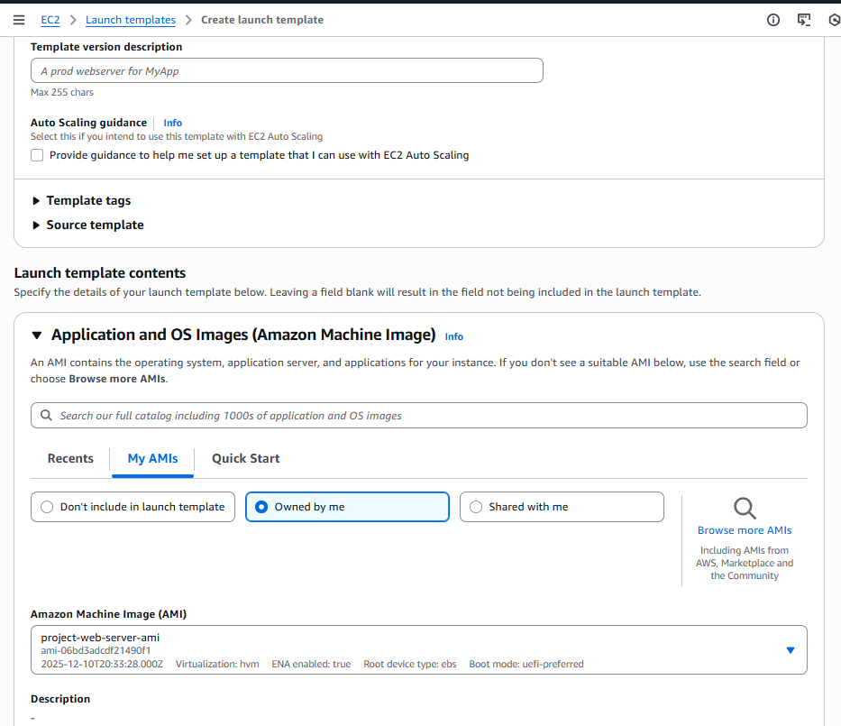

---

## Шаг 5. Создание Target Group

Я перехожу в **EC2 → Target Groups** и нажимаю **Create target group**.

Задаю параметры:

* **Name**: `project-target-group`
* **Target type**: `Instances`
* **Protocol**: `HTTP`
* **Port**: `80`
* **VPC**: созданная ранее VPC

После проверки настроек нажимаю **Next → Next → Create target group**.

Target Group создаётся и будет использоваться Application Load Balancer-ом для маршрутизации трафика.

### Параметры:

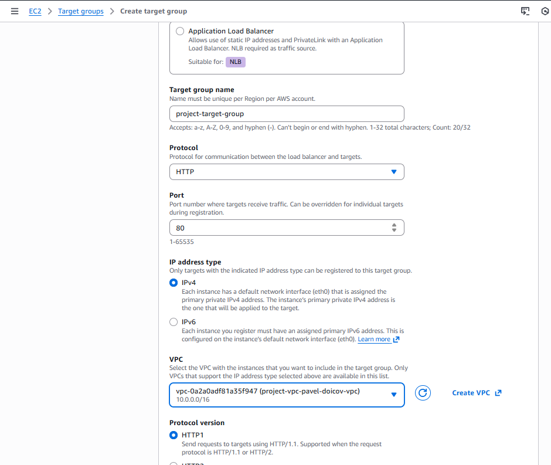

---

## Шаг 6. Создание Application Load Balancer

Я перехожу в **EC2 → Load Balancers** и нажимаю
**Create Load Balancer → Application Load Balancer**.

Указываю следующие параметры:

* **Name**: `project-alb`
* **Scheme**: `Internet-facing`
* **IP address type**: `IPv4`

### Network mapping

* **VPC**: созданная VPC
* **Subnets**: две публичные подсети в разных Availability Zones

### Security

* **Security Groups**: та же группа безопасности, что и у EC2-инстанса

### Listener and routing

* **Protocol**: `HTTP`
* **Port**: `80`
* **Default action**:
  `Forward → project-target-group`

После проверки настроек нажимаю **Create load balancer**.

После создания перехожу во вкладку **Resource map** и убеждаюсь, что существуют связи между **Listeners**, **Rules** и **Target Groups**.

Результат:
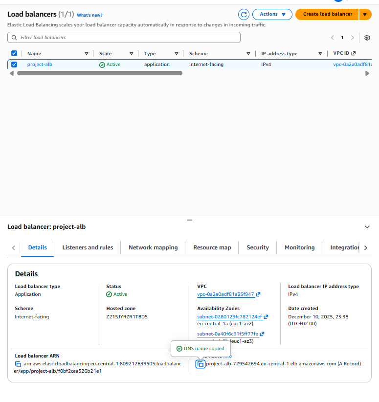

---

## Шаг 7. Создание Auto Scaling Group

Я перехожу в **EC2 → Auto Scaling Groups** и нажимаю **Create Auto Scaling group**.

Указываю:

* **Name**: `project-auto-scaling-group`
* **Launch template**: `project-launch-template`

---


### Выбор сетевых параметров

На этапе **Choose instance launch options**:

* **VPC**: созданная ранее VPC
* **Subnets**: две приватные подсети

Для параметра **Availability Zone distribution** выбираю:

```text
Balanced best effort
```

Это позволяет равномерно распределять инстансы между зонами доступности.


---

### Интеграция с Load Balancer

В разделе **Integrate with other services**:

* выбираю **Attach to an existing load balancer**
* указываю **Target Group**: `project-target-group`

Таким образом Auto Scaling Group автоматически управляет регистрацией инстансов в Target Group.

---

### Настройка масштабирования

В разделе **Configure group size and scaling** задаю:

* **Minimum capacity**: `2`
* **Desired capacity**: `2`
* **Maximum capacity**: `4`

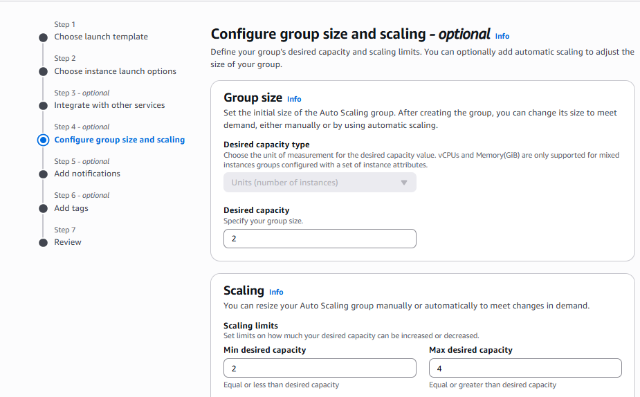
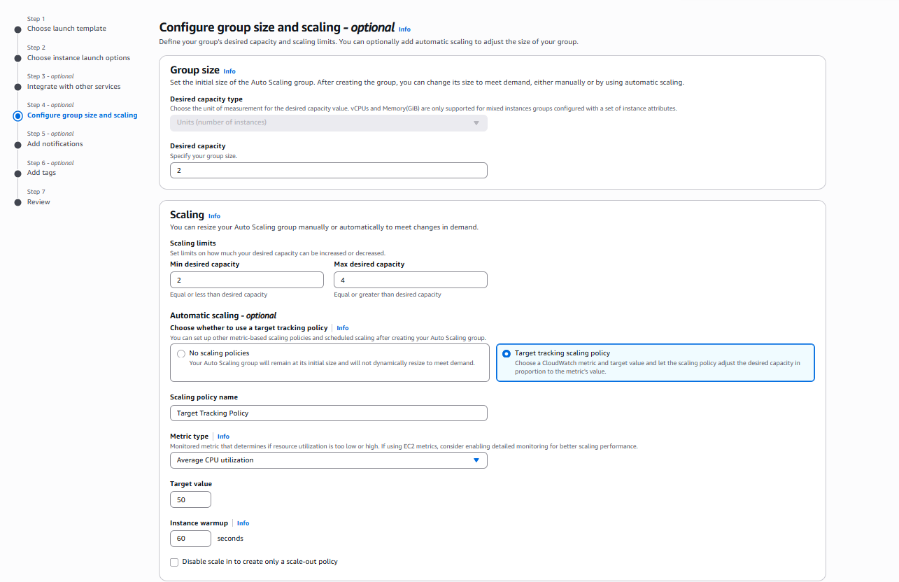

Настраиваю **Target tracking scaling policy**:

* **Metric**: Average CPU Utilization
* **Target value**: `50%`
* **Instance warm-up period**: `60 seconds`

В разделе **Additional settings** включаю:

* **Enable group metrics collection within CloudWatch**

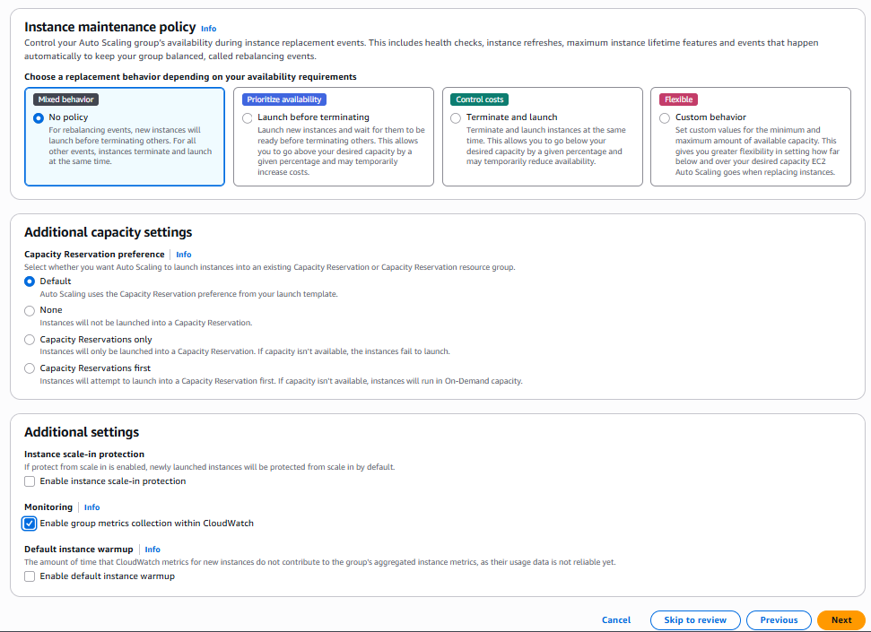

После этого нажимаю **Create Auto Scaling group**.

Результат:
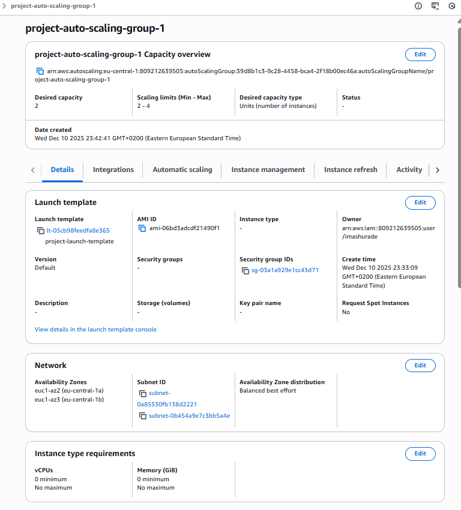
---

## Шаг 8. Тестирование Application Load Balancer

Я перехожу в **EC2 → Load Balancers**, выбираю `project-alb` и копирую его **DNS name**.

Вставляю DNS-имя в браузер и вижу страницу веб-сервера.

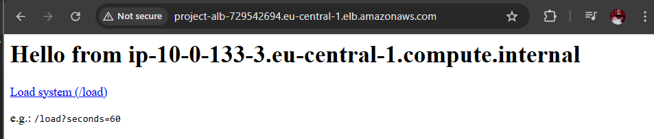

При многократном обновлении страницы наблюдаю разные **private IP-адреса** в ответах, что подтверждает распределение трафика между несколькими EC2-инстансами через Load Balancer.

Результат:
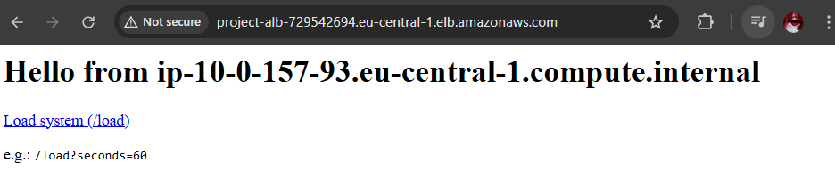
---

## Шаг 9. Тестирование Auto Scaling

Я перехожу в **CloudWatch → Alarms** и вижу автоматически созданные оповещения для Auto Scaling Group.

Открываю alarm вида:

```text
TargetTracking-XX-AlarmHigh
```

Изначально значение **CPU Utilization** находится на уровне `0–1%`.


---

### Создание нагрузки

В браузере я открываю **6–7 вкладок** со следующим адресом:

```text
http://<DNS_имя_Load_Balancer-а>/load?seconds=60
```

Либо использую скрипт `curl.sh`, указав DNS-имя Load Balancer-а.

Через несколько минут CPU Utilization возрастает, CloudWatch фиксирует превышение порогового значения, и alarm переходит в состояние **ALARM**.

*Скрин:*

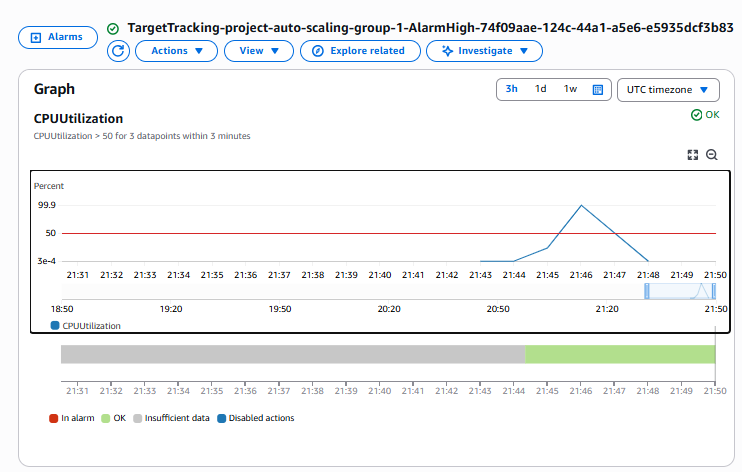

---

### Проверка масштабирования

Я перехожу в **EC2 → Instances** и наблюдаю увеличение количества EC2-инстансов (Auto Scaling Group масштабируется с 2 до 3–4 инстансов).

Это подтверждает, что Auto Scaling автоматически реагирует на рост нагрузки и обеспечивает масштабирование инфраструктуры.

---
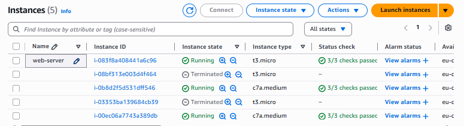

## Ответы на контрольные вопросы

### Что такое Image (AMI) и чем он отличается от Snapshot? Какие есть варианты использования AMI?

**AMI (Amazon Machine Image)** — шаблон для запуска EC2-инстансов (ОС + ПО + конфигурация).
**Snapshot** — снимок EBS-диска с данными.

**Отличия:**

* AMI используется для запуска EC2
* Snapshot используется для резервного копирования дисков

**Использование AMI:**

* Auto Scaling Group
* быстрое клонирование серверов
* перенос окружений (dev/prod)
* резервное копирование

---

### Что такое Launch Template и зачем он нужен? Чем отличается от Launch Configuration?

**Launch Template** — шаблон параметров запуска EC2 (AMI, тип, SG, UserData).

**Отличия:**

* поддерживает версии
* можно редактировать
* рекомендован AWS
  Launch Configuration — устаревший и неизменяемый.

---

### Зачем нужна Target Group?

**Target Group** — группа ресурсов, куда Load Balancer отправляет трафик.

**Роль:**

* хранит инстансы
* выполняет health checks
* связывает ALB и Auto Scaling Group

---

### В чём разница между Internet-facing и Internal Load Balancer?

* **Internet-facing** — доступен из интернета, публичный DNS
* **Internal** — доступен только внутри VPC

---

### Что такое Default action? Какие бывают?

**Default action** — действие ALB, если запрос не совпал с правилами.

**Типы:**

* Forward (передать в Target Group)
* Redirect
* Fixed response
* Authenticate (OIDC / Cognito)

---

### Почему Auto Scaling Group размещается в приватных подсетях?

Инстансы не должны быть доступны напрямую из интернета.
Доступ осуществляется **через Load Balancer**, что повышает безопасность.

---

### Зачем нужна настройка Availability Zone distribution?

Обеспечивает **равномерное распределение инстансов по зонам доступности**, повышая отказоустойчивость.

---

### Что такое Instance warm-up period и зачем он нужен?

**Warm-up period** — время, за которое новый инстанс выходит на рабочую нагрузку.
Позволяет Auto Scaling **не учитывать “холодный” инстанс в метриках** сразу после запуска.

---

### Какие IP-адреса видны при обращении к Load Balancer и почему?

Отображаются **приватные IP EC2-инстансов**, так как ALB распределяет запросы между инстансами из Target Group.

---

### Какую роль в процессе масштабирования сыграл Auto Scaling?

Auto Scaling:

* отслеживает метрики CPU через CloudWatch
* автоматически создаёт новые EC2 при высокой нагрузке
* уменьшает количество инстансов при снижении нагрузки

---

### Вывод

В ходе лабораторной работы была создана **отказоустойчивая и автоматически масштабируемая архитектура** с использованием AWS EC2, ALB, Auto Scaling и CloudWatch.

